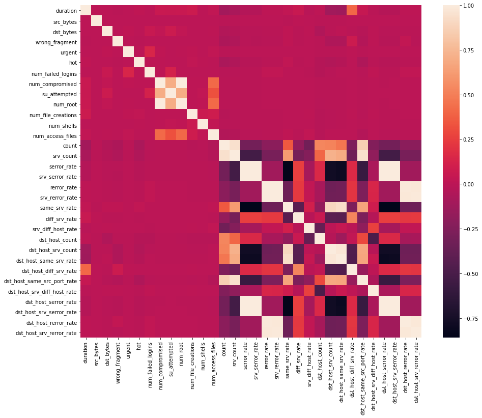

```python
import os
import pandas as pd
import numpy as np
import matplotlib.pyplot as plt
import seaborn as sns
import time
```


```python
with open("/kddcup.names",'r') as f:
    print(f.read())
```

    back,buffer_overflow,ftp_write,guess_passwd,imap,ipsweep,land,loadmodule,multihop,neptune,nmap,normal,perl,phf,pod,portsweep,rootkit,satan,smurf,spy,teardrop,warezclient,warezmaster.
    duration: continuous.
    protocol_type: symbolic.
    service: symbolic.
    flag: symbolic.
    src_bytes: continuous.
    dst_bytes: continuous.
    land: symbolic.
    wrong_fragment: continuous.
    urgent: continuous.
    hot: continuous.
    num_failed_logins: continuous.
    logged_in: symbolic.
    num_compromised: continuous.
    root_shell: continuous.
    su_attempted: continuous.
    num_root: continuous.
    num_file_creations: continuous.
    num_shells: continuous.
    num_access_files: continuous.
    num_outbound_cmds: continuous.
    is_host_login: symbolic.
    is_guest_login: symbolic.
    count: continuous.
    srv_count: continuous.
    serror_rate: continuous.
    srv_serror_rate: continuous.
    rerror_rate: continuous.
    srv_rerror_rate: continuous.
    same_srv_rate: continuous.
    diff_srv_rate: continuous.
    srv_diff_host_rate: continuous.
    dst_host_count: continuous.
    dst_host_srv_count: continuous.
    dst_host_same_srv_rate: continuous.
    dst_host_diff_srv_rate: continuous.
    dst_host_same_src_port_rate: continuous.
    dst_host_srv_diff_host_rate: continuous.
    dst_host_serror_rate: continuous.
    dst_host_srv_serror_rate: continuous.
    dst_host_rerror_rate: continuous.
    dst_host_srv_rerror_rate: continuous.
    
    


```python
cols="""duration,
protocol_type,
service,
flag,
src_bytes,
dst_bytes,
land,
wrong_fragment,
urgent,
hot,
num_failed_logins,
logged_in,
num_compromised,
root_shell,
su_attempted,
num_root,
num_file_creations,
num_shells,
num_access_files,
num_outbound_cmds,
is_host_login,
is_guest_login,
count,
srv_count,
serror_rate,
srv_serror_rate,
rerror_rate,
srv_rerror_rate,
same_srv_rate,
diff_srv_rate,
srv_diff_host_rate,
dst_host_count,
dst_host_srv_count,
dst_host_same_srv_rate,
dst_host_diff_srv_rate,
dst_host_same_src_port_rate,
dst_host_srv_diff_host_rate,
dst_host_serror_rate,
dst_host_srv_serror_rate,
dst_host_rerror_rate,
dst_host_srv_rerror_rate"""

columns=[]
for c in cols.split(','):
    if(c.strip()):
       columns.append(c.strip())

columns.append('target')
#print(columns)
print(len(columns))
```

    42
    


```python
with open("/training_attack_types",'r') as f:
    print(f.read())
```

    back dos
    buffer_overflow u2r
    ftp_write r2l
    guess_passwd r2l
    imap r2l
    ipsweep probe
    land dos
    loadmodule u2r
    multihop r2l
    neptune dos
    nmap probe
    perl u2r
    phf r2l
    pod dos
    portsweep probe
    rootkit u2r
    satan probe
    smurf dos
    spy r2l
    teardrop dos
    warezclient r2l
    warezmaster r2l
    
    
    


```python
attacks_types = {
    'normal': 'normal',
'back': 'dos',
'buffer_overflow': 'u2r',
'ftp_write': 'r2l',
'guess_passwd': 'r2l',
'imap': 'r2l',
'ipsweep': 'probe',
'land': 'dos',
'loadmodule': 'u2r',
'multihop': 'r2l',
'neptune': 'dos',
'nmap': 'probe',
'perl': 'u2r',
'phf': 'r2l',
'pod': 'dos',
'portsweep': 'probe',
'rootkit': 'u2r',
'satan': 'probe',
'smurf': 'dos',
'spy': 'r2l',
'teardrop': 'dos',
'warezclient': 'r2l',
'warezmaster': 'r2l',
}
```


```python
# import dataset, we choos to work on only 10% of the dataset to save computational power 
path = "/kddcup.data_10_percent_corrected"
df = pd.read_csv(path,names=columns)

#applying previously built attack type columns
df['Attack Type'] = df.target.apply(lambda r:attacks_types[r[:-1]])

df.head(10)
```


<div>
<style scoped>
    .dataframe tbody tr th:only-of-type {
        vertical-align: middle;
    }

    .dataframe tbody tr th {
        vertical-align: top;
    }

    .dataframe thead th {
        text-align: right;
    }
</style>
<table border="1" class="dataframe">
  <thead>
    <tr style="text-align: right;">
      <th></th>
      <th>duration</th>
      <th>protocol_type</th>
      <th>service</th>
      <th>flag</th>
      <th>src_bytes</th>
      <th>dst_bytes</th>
      <th>land</th>
      <th>wrong_fragment</th>
      <th>urgent</th>
      <th>hot</th>
      <th>num_failed_logins</th>
      <th>logged_in</th>
      <th>num_compromised</th>
      <th>root_shell</th>
      <th>su_attempted</th>
      <th>num_root</th>
      <th>num_file_creations</th>
      <th>num_shells</th>
      <th>num_access_files</th>
      <th>num_outbound_cmds</th>
      <th>is_host_login</th>
      <th>is_guest_login</th>
      <th>count</th>
      <th>srv_count</th>
      <th>serror_rate</th>
      <th>srv_serror_rate</th>
      <th>rerror_rate</th>
      <th>srv_rerror_rate</th>
      <th>same_srv_rate</th>
      <th>diff_srv_rate</th>
      <th>srv_diff_host_rate</th>
      <th>dst_host_count</th>
      <th>dst_host_srv_count</th>
      <th>dst_host_same_srv_rate</th>
      <th>dst_host_diff_srv_rate</th>
      <th>dst_host_same_src_port_rate</th>
      <th>dst_host_srv_diff_host_rate</th>
      <th>dst_host_serror_rate</th>
      <th>dst_host_srv_serror_rate</th>
      <th>dst_host_rerror_rate</th>
      <th>dst_host_srv_rerror_rate</th>
      <th>target</th>
      <th>Attack Type</th>
    </tr>
  </thead>
  <tbody>
    <tr>
      <th>0</th>
      <td>0</td>
      <td>tcp</td>
      <td>http</td>
      <td>SF</td>
      <td>181</td>
      <td>5450</td>
      <td>0</td>
      <td>0</td>
      <td>0</td>
      <td>0</td>
      <td>0</td>
      <td>1</td>
      <td>0</td>
      <td>0</td>
      <td>0</td>
      <td>0</td>
      <td>0</td>
      <td>0</td>
      <td>0</td>
      <td>0</td>
      <td>0</td>
      <td>0</td>
      <td>8</td>
      <td>8</td>
      <td>0.0</td>
      <td>0.0</td>
      <td>0.0</td>
      <td>0.0</td>
      <td>1.0</td>
      <td>0.0</td>
      <td>0.0</td>
      <td>9</td>
      <td>9</td>
      <td>1.0</td>
      <td>0.0</td>
      <td>0.11</td>
      <td>0.00</td>
      <td>0.0</td>
      <td>0.0</td>
      <td>0.0</td>
      <td>0.0</td>
      <td>normal.</td>
      <td>normal</td>
    </tr>
    <tr>
      <th>1</th>
      <td>0</td>
      <td>tcp</td>
      <td>http</td>
      <td>SF</td>
      <td>239</td>
      <td>486</td>
      <td>0</td>
      <td>0</td>
      <td>0</td>
      <td>0</td>
      <td>0</td>
      <td>1</td>
      <td>0</td>
      <td>0</td>
      <td>0</td>
      <td>0</td>
      <td>0</td>
      <td>0</td>
      <td>0</td>
      <td>0</td>
      <td>0</td>
      <td>0</td>
      <td>8</td>
      <td>8</td>
      <td>0.0</td>
      <td>0.0</td>
      <td>0.0</td>
      <td>0.0</td>
      <td>1.0</td>
      <td>0.0</td>
      <td>0.0</td>
      <td>19</td>
      <td>19</td>
      <td>1.0</td>
      <td>0.0</td>
      <td>0.05</td>
      <td>0.00</td>
      <td>0.0</td>
      <td>0.0</td>
      <td>0.0</td>
      <td>0.0</td>
      <td>normal.</td>
      <td>normal</td>
    </tr>
    <tr>
      <th>2</th>
      <td>0</td>
      <td>tcp</td>
      <td>http</td>
      <td>SF</td>
      <td>235</td>
      <td>1337</td>
      <td>0</td>
      <td>0</td>
      <td>0</td>
      <td>0</td>
      <td>0</td>
      <td>1</td>
      <td>0</td>
      <td>0</td>
      <td>0</td>
      <td>0</td>
      <td>0</td>
      <td>0</td>
      <td>0</td>
      <td>0</td>
      <td>0</td>
      <td>0</td>
      <td>8</td>
      <td>8</td>
      <td>0.0</td>
      <td>0.0</td>
      <td>0.0</td>
      <td>0.0</td>
      <td>1.0</td>
      <td>0.0</td>
      <td>0.0</td>
      <td>29</td>
      <td>29</td>
      <td>1.0</td>
      <td>0.0</td>
      <td>0.03</td>
      <td>0.00</td>
      <td>0.0</td>
      <td>0.0</td>
      <td>0.0</td>
      <td>0.0</td>
      <td>normal.</td>
      <td>normal</td>
    </tr>
    <tr>
      <th>3</th>
      <td>0</td>
      <td>tcp</td>
      <td>http</td>
      <td>SF</td>
      <td>219</td>
      <td>1337</td>
      <td>0</td>
      <td>0</td>
      <td>0</td>
      <td>0</td>
      <td>0</td>
      <td>1</td>
      <td>0</td>
      <td>0</td>
      <td>0</td>
      <td>0</td>
      <td>0</td>
      <td>0</td>
      <td>0</td>
      <td>0</td>
      <td>0</td>
      <td>0</td>
      <td>6</td>
      <td>6</td>
      <td>0.0</td>
      <td>0.0</td>
      <td>0.0</td>
      <td>0.0</td>
      <td>1.0</td>
      <td>0.0</td>
      <td>0.0</td>
      <td>39</td>
      <td>39</td>
      <td>1.0</td>
      <td>0.0</td>
      <td>0.03</td>
      <td>0.00</td>
      <td>0.0</td>
      <td>0.0</td>
      <td>0.0</td>
      <td>0.0</td>
      <td>normal.</td>
      <td>normal</td>
    </tr>
    <tr>
      <th>4</th>
      <td>0</td>
      <td>tcp</td>
      <td>http</td>
      <td>SF</td>
      <td>217</td>
      <td>2032</td>
      <td>0</td>
      <td>0</td>
      <td>0</td>
      <td>0</td>
      <td>0</td>
      <td>1</td>
      <td>0</td>
      <td>0</td>
      <td>0</td>
      <td>0</td>
      <td>0</td>
      <td>0</td>
      <td>0</td>
      <td>0</td>
      <td>0</td>
      <td>0</td>
      <td>6</td>
      <td>6</td>
      <td>0.0</td>
      <td>0.0</td>
      <td>0.0</td>
      <td>0.0</td>
      <td>1.0</td>
      <td>0.0</td>
      <td>0.0</td>
      <td>49</td>
      <td>49</td>
      <td>1.0</td>
      <td>0.0</td>
      <td>0.02</td>
      <td>0.00</td>
      <td>0.0</td>
      <td>0.0</td>
      <td>0.0</td>
      <td>0.0</td>
      <td>normal.</td>
      <td>normal</td>
    </tr>
    <tr>
      <th>5</th>
      <td>0</td>
      <td>tcp</td>
      <td>http</td>
      <td>SF</td>
      <td>217</td>
      <td>2032</td>
      <td>0</td>
      <td>0</td>
      <td>0</td>
      <td>0</td>
      <td>0</td>
      <td>1</td>
      <td>0</td>
      <td>0</td>
      <td>0</td>
      <td>0</td>
      <td>0</td>
      <td>0</td>
      <td>0</td>
      <td>0</td>
      <td>0</td>
      <td>0</td>
      <td>6</td>
      <td>6</td>
      <td>0.0</td>
      <td>0.0</td>
      <td>0.0</td>
      <td>0.0</td>
      <td>1.0</td>
      <td>0.0</td>
      <td>0.0</td>
      <td>59</td>
      <td>59</td>
      <td>1.0</td>
      <td>0.0</td>
      <td>0.02</td>
      <td>0.00</td>
      <td>0.0</td>
      <td>0.0</td>
      <td>0.0</td>
      <td>0.0</td>
      <td>normal.</td>
      <td>normal</td>
    </tr>
    <tr>
      <th>6</th>
      <td>0</td>
      <td>tcp</td>
      <td>http</td>
      <td>SF</td>
      <td>212</td>
      <td>1940</td>
      <td>0</td>
      <td>0</td>
      <td>0</td>
      <td>0</td>
      <td>0</td>
      <td>1</td>
      <td>0</td>
      <td>0</td>
      <td>0</td>
      <td>0</td>
      <td>0</td>
      <td>0</td>
      <td>0</td>
      <td>0</td>
      <td>0</td>
      <td>0</td>
      <td>1</td>
      <td>2</td>
      <td>0.0</td>
      <td>0.0</td>
      <td>0.0</td>
      <td>0.0</td>
      <td>1.0</td>
      <td>0.0</td>
      <td>1.0</td>
      <td>1</td>
      <td>69</td>
      <td>1.0</td>
      <td>0.0</td>
      <td>1.00</td>
      <td>0.04</td>
      <td>0.0</td>
      <td>0.0</td>
      <td>0.0</td>
      <td>0.0</td>
      <td>normal.</td>
      <td>normal</td>
    </tr>
    <tr>
      <th>7</th>
      <td>0</td>
      <td>tcp</td>
      <td>http</td>
      <td>SF</td>
      <td>159</td>
      <td>4087</td>
      <td>0</td>
      <td>0</td>
      <td>0</td>
      <td>0</td>
      <td>0</td>
      <td>1</td>
      <td>0</td>
      <td>0</td>
      <td>0</td>
      <td>0</td>
      <td>0</td>
      <td>0</td>
      <td>0</td>
      <td>0</td>
      <td>0</td>
      <td>0</td>
      <td>5</td>
      <td>5</td>
      <td>0.0</td>
      <td>0.0</td>
      <td>0.0</td>
      <td>0.0</td>
      <td>1.0</td>
      <td>0.0</td>
      <td>0.0</td>
      <td>11</td>
      <td>79</td>
      <td>1.0</td>
      <td>0.0</td>
      <td>0.09</td>
      <td>0.04</td>
      <td>0.0</td>
      <td>0.0</td>
      <td>0.0</td>
      <td>0.0</td>
      <td>normal.</td>
      <td>normal</td>
    </tr>
    <tr>
      <th>8</th>
      <td>0</td>
      <td>tcp</td>
      <td>http</td>
      <td>SF</td>
      <td>210</td>
      <td>151</td>
      <td>0</td>
      <td>0</td>
      <td>0</td>
      <td>0</td>
      <td>0</td>
      <td>1</td>
      <td>0</td>
      <td>0</td>
      <td>0</td>
      <td>0</td>
      <td>0</td>
      <td>0</td>
      <td>0</td>
      <td>0</td>
      <td>0</td>
      <td>0</td>
      <td>8</td>
      <td>8</td>
      <td>0.0</td>
      <td>0.0</td>
      <td>0.0</td>
      <td>0.0</td>
      <td>1.0</td>
      <td>0.0</td>
      <td>0.0</td>
      <td>8</td>
      <td>89</td>
      <td>1.0</td>
      <td>0.0</td>
      <td>0.12</td>
      <td>0.04</td>
      <td>0.0</td>
      <td>0.0</td>
      <td>0.0</td>
      <td>0.0</td>
      <td>normal.</td>
      <td>normal</td>
    </tr>
    <tr>
      <th>9</th>
      <td>0</td>
      <td>tcp</td>
      <td>http</td>
      <td>SF</td>
      <td>212</td>
      <td>786</td>
      <td>0</td>
      <td>0</td>
      <td>0</td>
      <td>1</td>
      <td>0</td>
      <td>1</td>
      <td>0</td>
      <td>0</td>
      <td>0</td>
      <td>0</td>
      <td>0</td>
      <td>0</td>
      <td>0</td>
      <td>0</td>
      <td>0</td>
      <td>0</td>
      <td>8</td>
      <td>8</td>
      <td>0.0</td>
      <td>0.0</td>
      <td>0.0</td>
      <td>0.0</td>
      <td>1.0</td>
      <td>0.0</td>
      <td>0.0</td>
      <td>8</td>
      <td>99</td>
      <td>1.0</td>
      <td>0.0</td>
      <td>0.12</td>
      <td>0.05</td>
      <td>0.0</td>
      <td>0.0</td>
      <td>0.0</td>
      <td>0.0</td>
      <td>normal.</td>
      <td>normal</td>
    </tr>
  </tbody>
</table>
</div>


```python
df.shape
```


    (494021, 43)


```python
df['target'].value_counts()
```


    smurf.              280790
    neptune.            107201
    normal.              97278
    back.                 2203
    satan.                1589
    ipsweep.              1247
    portsweep.            1040
    warezclient.          1020
    teardrop.              979
    pod.                   264
    nmap.                  231
    guess_passwd.           53
    buffer_overflow.        30
    land.                   21
    warezmaster.            20
    imap.                   12
    rootkit.                10
    loadmodule.              9
    ftp_write.               8
    multihop.                7
    phf.                     4
    perl.                    3
    spy.                     2
    Name: target, dtype: int64


```python
df['Attack Type'].value_counts()
```


    dos       391458
    normal     97278
    probe       4107
    r2l         1126
    u2r           52
    Name: Attack Type, dtype: int64


```python
df.dtypes
```


    duration                         int64
    protocol_type                   object
    service                         object
    flag                            object
    src_bytes                        int64
    dst_bytes                        int64
    land                             int64
    wrong_fragment                   int64
    urgent                           int64
    hot                              int64
    num_failed_logins                int64
    logged_in                        int64
    num_compromised                  int64
    root_shell                       int64
    su_attempted                     int64
    num_root                         int64
    num_file_creations               int64
    num_shells                       int64
    num_access_files                 int64
    num_outbound_cmds                int64
    is_host_login                    int64
    is_guest_login                   int64
    count                            int64
    srv_count                        int64
    serror_rate                    float64
    srv_serror_rate                float64
    rerror_rate                    float64
    srv_rerror_rate                float64
    same_srv_rate                  float64
    diff_srv_rate                  float64
    srv_diff_host_rate             float64
    dst_host_count                   int64
    dst_host_srv_count               int64
    dst_host_same_srv_rate         float64
    dst_host_diff_srv_rate         float64
    dst_host_same_src_port_rate    float64
    dst_host_srv_diff_host_rate    float64
    dst_host_serror_rate           float64
    dst_host_srv_serror_rate       float64
    dst_host_rerror_rate           float64
    dst_host_srv_rerror_rate       float64
    target                          object
    Attack Type                     object
    dtype: object


```python
#preprocessing and exploration
# categories 
num_cols = df._get_numeric_data().columns

cate_cols = list(set(df.columns)-set(num_cols))
cate_cols.remove('target')
cate_cols.remove('Attack Type')

cate_cols
```


    ['service', 'flag', 'protocol_type']


```python
# feature distribution category protocol type
#Visualization
def bar_graph(feature):
    df[feature].value_counts().plot(kind="bar",color="pink")
bar_graph('protocol_type')
```


    

    


```python
df['protocol_type'].value_counts()
```


    icmp    283602
    tcp     190065
    udp      20354
    Name: protocol_type, dtype: int64


```python
bar_graph('Attack Type')
```


    

    


```python
#data correlation
df = df.dropna('columns')# drop columns with NaN

df = df[[col for col in df if df[col].nunique() > 2]]# keep columns where there are more than 2 unique values

corr = df.corr()

plt.figure(figsize=(15,12))

sns.heatmap(corr)

plt.show()
```


    

    


```python
# dropping highly correlated columns

df.drop('num_root',axis = 1,inplace = True)
df.drop('srv_serror_rate',axis = 1,inplace = True)
df.drop('srv_rerror_rate',axis = 1, inplace=True)
df.drop('dst_host_srv_serror_rate',axis = 1, inplace=True)
df.drop('dst_host_serror_rate',axis = 1, inplace=True)
df.drop('dst_host_rerror_rate',axis = 1, inplace=True)
df.drop('dst_host_srv_rerror_rate',axis = 1, inplace=True)
df.drop('dst_host_same_srv_rate',axis = 1, inplace=True)
df.drop('service',axis = 1,inplace= True)
df = df.drop(['target',], axis=1)
```


```python
df.head(5)
```


<div>
<style scoped>
    .dataframe tbody tr th:only-of-type {
        vertical-align: middle;
    }

    .dataframe tbody tr th {
        vertical-align: top;
    }

    .dataframe thead th {
        text-align: right;
    }
</style>
<table border="1" class="dataframe">
  <thead>
    <tr style="text-align: right;">
      <th></th>
      <th>duration</th>
      <th>protocol_type</th>
      <th>flag</th>
      <th>src_bytes</th>
      <th>dst_bytes</th>
      <th>wrong_fragment</th>
      <th>urgent</th>
      <th>hot</th>
      <th>num_failed_logins</th>
      <th>num_compromised</th>
      <th>su_attempted</th>
      <th>num_file_creations</th>
      <th>num_shells</th>
      <th>num_access_files</th>
      <th>count</th>
      <th>srv_count</th>
      <th>serror_rate</th>
      <th>rerror_rate</th>
      <th>same_srv_rate</th>
      <th>diff_srv_rate</th>
      <th>srv_diff_host_rate</th>
      <th>dst_host_count</th>
      <th>dst_host_srv_count</th>
      <th>dst_host_diff_srv_rate</th>
      <th>dst_host_same_src_port_rate</th>
      <th>dst_host_srv_diff_host_rate</th>
      <th>Attack Type</th>
    </tr>
  </thead>
  <tbody>
    <tr>
      <th>0</th>
      <td>0</td>
      <td>tcp</td>
      <td>SF</td>
      <td>181</td>
      <td>5450</td>
      <td>0</td>
      <td>0</td>
      <td>0</td>
      <td>0</td>
      <td>0</td>
      <td>0</td>
      <td>0</td>
      <td>0</td>
      <td>0</td>
      <td>8</td>
      <td>8</td>
      <td>0.0</td>
      <td>0.0</td>
      <td>1.0</td>
      <td>0.0</td>
      <td>0.0</td>
      <td>9</td>
      <td>9</td>
      <td>0.0</td>
      <td>0.11</td>
      <td>0.0</td>
      <td>normal</td>
    </tr>
    <tr>
      <th>1</th>
      <td>0</td>
      <td>tcp</td>
      <td>SF</td>
      <td>239</td>
      <td>486</td>
      <td>0</td>
      <td>0</td>
      <td>0</td>
      <td>0</td>
      <td>0</td>
      <td>0</td>
      <td>0</td>
      <td>0</td>
      <td>0</td>
      <td>8</td>
      <td>8</td>
      <td>0.0</td>
      <td>0.0</td>
      <td>1.0</td>
      <td>0.0</td>
      <td>0.0</td>
      <td>19</td>
      <td>19</td>
      <td>0.0</td>
      <td>0.05</td>
      <td>0.0</td>
      <td>normal</td>
    </tr>
    <tr>
      <th>2</th>
      <td>0</td>
      <td>tcp</td>
      <td>SF</td>
      <td>235</td>
      <td>1337</td>
      <td>0</td>
      <td>0</td>
      <td>0</td>
      <td>0</td>
      <td>0</td>
      <td>0</td>
      <td>0</td>
      <td>0</td>
      <td>0</td>
      <td>8</td>
      <td>8</td>
      <td>0.0</td>
      <td>0.0</td>
      <td>1.0</td>
      <td>0.0</td>
      <td>0.0</td>
      <td>29</td>
      <td>29</td>
      <td>0.0</td>
      <td>0.03</td>
      <td>0.0</td>
      <td>normal</td>
    </tr>
    <tr>
      <th>3</th>
      <td>0</td>
      <td>tcp</td>
      <td>SF</td>
      <td>219</td>
      <td>1337</td>
      <td>0</td>
      <td>0</td>
      <td>0</td>
      <td>0</td>
      <td>0</td>
      <td>0</td>
      <td>0</td>
      <td>0</td>
      <td>0</td>
      <td>6</td>
      <td>6</td>
      <td>0.0</td>
      <td>0.0</td>
      <td>1.0</td>
      <td>0.0</td>
      <td>0.0</td>
      <td>39</td>
      <td>39</td>
      <td>0.0</td>
      <td>0.03</td>
      <td>0.0</td>
      <td>normal</td>
    </tr>
    <tr>
      <th>4</th>
      <td>0</td>
      <td>tcp</td>
      <td>SF</td>
      <td>217</td>
      <td>2032</td>
      <td>0</td>
      <td>0</td>
      <td>0</td>
      <td>0</td>
      <td>0</td>
      <td>0</td>
      <td>0</td>
      <td>0</td>
      <td>0</td>
      <td>6</td>
      <td>6</td>
      <td>0.0</td>
      <td>0.0</td>
      <td>1.0</td>
      <td>0.0</td>
      <td>0.0</td>
      <td>49</td>
      <td>49</td>
      <td>0.0</td>
      <td>0.02</td>
      <td>0.0</td>
      <td>normal</td>
    </tr>
  </tbody>
</table>
</div>


```python
#features
#protocol_type feature mapping
pmap = {'icmp':0,'tcp':1,'udp':2}
df['protocol_type'] = df['protocol_type'].map(pmap)

```


```python

df.head()
```


<div>
<style scoped>
    .dataframe tbody tr th:only-of-type {
        vertical-align: middle;
    }

    .dataframe tbody tr th {
        vertical-align: top;
    }

    .dataframe thead th {
        text-align: right;
    }
</style>
<table border="1" class="dataframe">
  <thead>
    <tr style="text-align: right;">
      <th></th>
      <th>duration</th>
      <th>protocol_type</th>
      <th>flag</th>
      <th>src_bytes</th>
      <th>dst_bytes</th>
      <th>wrong_fragment</th>
      <th>urgent</th>
      <th>hot</th>
      <th>num_failed_logins</th>
      <th>num_compromised</th>
      <th>su_attempted</th>
      <th>num_file_creations</th>
      <th>num_shells</th>
      <th>num_access_files</th>
      <th>count</th>
      <th>srv_count</th>
      <th>serror_rate</th>
      <th>rerror_rate</th>
      <th>same_srv_rate</th>
      <th>diff_srv_rate</th>
      <th>srv_diff_host_rate</th>
      <th>dst_host_count</th>
      <th>dst_host_srv_count</th>
      <th>dst_host_diff_srv_rate</th>
      <th>dst_host_same_src_port_rate</th>
      <th>dst_host_srv_diff_host_rate</th>
      <th>Attack Type</th>
    </tr>
  </thead>
  <tbody>
    <tr>
      <th>0</th>
      <td>0</td>
      <td>1</td>
      <td>SF</td>
      <td>181</td>
      <td>5450</td>
      <td>0</td>
      <td>0</td>
      <td>0</td>
      <td>0</td>
      <td>0</td>
      <td>0</td>
      <td>0</td>
      <td>0</td>
      <td>0</td>
      <td>8</td>
      <td>8</td>
      <td>0.0</td>
      <td>0.0</td>
      <td>1.0</td>
      <td>0.0</td>
      <td>0.0</td>
      <td>9</td>
      <td>9</td>
      <td>0.0</td>
      <td>0.11</td>
      <td>0.0</td>
      <td>normal</td>
    </tr>
    <tr>
      <th>1</th>
      <td>0</td>
      <td>1</td>
      <td>SF</td>
      <td>239</td>
      <td>486</td>
      <td>0</td>
      <td>0</td>
      <td>0</td>
      <td>0</td>
      <td>0</td>
      <td>0</td>
      <td>0</td>
      <td>0</td>
      <td>0</td>
      <td>8</td>
      <td>8</td>
      <td>0.0</td>
      <td>0.0</td>
      <td>1.0</td>
      <td>0.0</td>
      <td>0.0</td>
      <td>19</td>
      <td>19</td>
      <td>0.0</td>
      <td>0.05</td>
      <td>0.0</td>
      <td>normal</td>
    </tr>
    <tr>
      <th>2</th>
      <td>0</td>
      <td>1</td>
      <td>SF</td>
      <td>235</td>
      <td>1337</td>
      <td>0</td>
      <td>0</td>
      <td>0</td>
      <td>0</td>
      <td>0</td>
      <td>0</td>
      <td>0</td>
      <td>0</td>
      <td>0</td>
      <td>8</td>
      <td>8</td>
      <td>0.0</td>
      <td>0.0</td>
      <td>1.0</td>
      <td>0.0</td>
      <td>0.0</td>
      <td>29</td>
      <td>29</td>
      <td>0.0</td>
      <td>0.03</td>
      <td>0.0</td>
      <td>normal</td>
    </tr>
    <tr>
      <th>3</th>
      <td>0</td>
      <td>1</td>
      <td>SF</td>
      <td>219</td>
      <td>1337</td>
      <td>0</td>
      <td>0</td>
      <td>0</td>
      <td>0</td>
      <td>0</td>
      <td>0</td>
      <td>0</td>
      <td>0</td>
      <td>0</td>
      <td>6</td>
      <td>6</td>
      <td>0.0</td>
      <td>0.0</td>
      <td>1.0</td>
      <td>0.0</td>
      <td>0.0</td>
      <td>39</td>
      <td>39</td>
      <td>0.0</td>
      <td>0.03</td>
      <td>0.0</td>
      <td>normal</td>
    </tr>
    <tr>
      <th>4</th>
      <td>0</td>
      <td>1</td>
      <td>SF</td>
      <td>217</td>
      <td>2032</td>
      <td>0</td>
      <td>0</td>
      <td>0</td>
      <td>0</td>
      <td>0</td>
      <td>0</td>
      <td>0</td>
      <td>0</td>
      <td>0</td>
      <td>6</td>
      <td>6</td>
      <td>0.0</td>
      <td>0.0</td>
      <td>1.0</td>
      <td>0.0</td>
      <td>0.0</td>
      <td>49</td>
      <td>49</td>
      <td>0.0</td>
      <td>0.02</td>
      <td>0.0</td>
      <td>normal</td>
    </tr>
  </tbody>
</table>
</div>


```python
#flag feature mapping
fmap = {'SF':0,'S0':1,'REJ':2,'RSTR':3,'RSTO':4,'SH':5 ,'S1':6 ,'S2':7,'RSTOS0':8,'S3':9 ,'OTH':10}
df['flag'] = df['flag'].map(fmap)
```


```python

df.head()
```


<div>
<style scoped>
    .dataframe tbody tr th:only-of-type {
        vertical-align: middle;
    }

    .dataframe tbody tr th {
        vertical-align: top;
    }

    .dataframe thead th {
        text-align: right;
    }
</style>
<table border="1" class="dataframe">
  <thead>
    <tr style="text-align: right;">
      <th></th>
      <th>duration</th>
      <th>protocol_type</th>
      <th>flag</th>
      <th>src_bytes</th>
      <th>dst_bytes</th>
      <th>wrong_fragment</th>
      <th>urgent</th>
      <th>hot</th>
      <th>num_failed_logins</th>
      <th>num_compromised</th>
      <th>su_attempted</th>
      <th>num_file_creations</th>
      <th>num_shells</th>
      <th>num_access_files</th>
      <th>count</th>
      <th>srv_count</th>
      <th>serror_rate</th>
      <th>rerror_rate</th>
      <th>same_srv_rate</th>
      <th>diff_srv_rate</th>
      <th>srv_diff_host_rate</th>
      <th>dst_host_count</th>
      <th>dst_host_srv_count</th>
      <th>dst_host_diff_srv_rate</th>
      <th>dst_host_same_src_port_rate</th>
      <th>dst_host_srv_diff_host_rate</th>
      <th>Attack Type</th>
    </tr>
  </thead>
  <tbody>
    <tr>
      <th>0</th>
      <td>0</td>
      <td>1</td>
      <td>0</td>
      <td>181</td>
      <td>5450</td>
      <td>0</td>
      <td>0</td>
      <td>0</td>
      <td>0</td>
      <td>0</td>
      <td>0</td>
      <td>0</td>
      <td>0</td>
      <td>0</td>
      <td>8</td>
      <td>8</td>
      <td>0.0</td>
      <td>0.0</td>
      <td>1.0</td>
      <td>0.0</td>
      <td>0.0</td>
      <td>9</td>
      <td>9</td>
      <td>0.0</td>
      <td>0.11</td>
      <td>0.0</td>
      <td>normal</td>
    </tr>
    <tr>
      <th>1</th>
      <td>0</td>
      <td>1</td>
      <td>0</td>
      <td>239</td>
      <td>486</td>
      <td>0</td>
      <td>0</td>
      <td>0</td>
      <td>0</td>
      <td>0</td>
      <td>0</td>
      <td>0</td>
      <td>0</td>
      <td>0</td>
      <td>8</td>
      <td>8</td>
      <td>0.0</td>
      <td>0.0</td>
      <td>1.0</td>
      <td>0.0</td>
      <td>0.0</td>
      <td>19</td>
      <td>19</td>
      <td>0.0</td>
      <td>0.05</td>
      <td>0.0</td>
      <td>normal</td>
    </tr>
    <tr>
      <th>2</th>
      <td>0</td>
      <td>1</td>
      <td>0</td>
      <td>235</td>
      <td>1337</td>
      <td>0</td>
      <td>0</td>
      <td>0</td>
      <td>0</td>
      <td>0</td>
      <td>0</td>
      <td>0</td>
      <td>0</td>
      <td>0</td>
      <td>8</td>
      <td>8</td>
      <td>0.0</td>
      <td>0.0</td>
      <td>1.0</td>
      <td>0.0</td>
      <td>0.0</td>
      <td>29</td>
      <td>29</td>
      <td>0.0</td>
      <td>0.03</td>
      <td>0.0</td>
      <td>normal</td>
    </tr>
    <tr>
      <th>3</th>
      <td>0</td>
      <td>1</td>
      <td>0</td>
      <td>219</td>
      <td>1337</td>
      <td>0</td>
      <td>0</td>
      <td>0</td>
      <td>0</td>
      <td>0</td>
      <td>0</td>
      <td>0</td>
      <td>0</td>
      <td>0</td>
      <td>6</td>
      <td>6</td>
      <td>0.0</td>
      <td>0.0</td>
      <td>1.0</td>
      <td>0.0</td>
      <td>0.0</td>
      <td>39</td>
      <td>39</td>
      <td>0.0</td>
      <td>0.03</td>
      <td>0.0</td>
      <td>normal</td>
    </tr>
    <tr>
      <th>4</th>
      <td>0</td>
      <td>1</td>
      <td>0</td>
      <td>217</td>
      <td>2032</td>
      <td>0</td>
      <td>0</td>
      <td>0</td>
      <td>0</td>
      <td>0</td>
      <td>0</td>
      <td>0</td>
      <td>0</td>
      <td>0</td>
      <td>6</td>
      <td>6</td>
      <td>0.0</td>
      <td>0.0</td>
      <td>1.0</td>
      <td>0.0</td>
      <td>0.0</td>
      <td>49</td>
      <td>49</td>
      <td>0.0</td>
      <td>0.02</td>
      <td>0.0</td>
      <td>normal</td>
    </tr>
  </tbody>
</table>
</div>


```python
from sklearn.model_selection import train_test_split
from sklearn.preprocessing import MinMaxScaler
y = df[['Attack Type']]
X = df.drop(['Attack Type',], axis=1)

sc = MinMaxScaler()
X = sc.fit_transform(X)

# Split test and train data 
X_train, X_test, y_train, y_test = train_test_split(X, y, test_size=0.33, random_state=42)
print(X_train.shape, X_test.shape)
print(y_train.shape, y_test.shape)
```

    (330994, 26) (163027, 26)
    (330994, 1) (163027, 1)
    


```python
# Decision tree
from sklearn.tree import DecisionTreeClassifier
clfd = DecisionTreeClassifier(criterion="entropy", max_depth = 4)
start_time = time.time()
clfd.fit(X_train, y_train.values.ravel())
end_time = time.time()
print("Training time: ",end_time-start_time)
```

    Training time:  1.014498233795166
    


```python
start_time = time.time()
y_test_pred = clfd.predict(X_train)
end_time = time.time()
print("Testing time: ",end_time-start_time)
```

    Testing time:  0.06203341484069824
    


```python
print("Decision tree Train score is:", clfd.score(X_train, y_train))
print("Decision tree Test score is:",clfd.score(X_test,y_test))
```

    Decision tree Train score is: 0.9905829108684749
    Decision tree Test score is: 0.9905230421954646
    


```python
from sklearn.ensemble import RandomForestClassifier
clfr = RandomForestClassifier(n_estimators=30)
start_time = time.time()
clfr.fit(X_train, y_train.values.ravel())
end_time = time.time()
print("RF Training time: ",end_time-start_time)
```

    RF Training time:  6.87580943107605
    


```python
start_time = time.time()
y_test_pred = clfd.predict(X_train)
end_time = time.time()
print("RF Testing time: ",end_time-start_time)
```

    RF Testing time:  0.04481768608093262
    


```python
print("RF Train score is:", clfr.score(X_train, y_train))
print("RF Test score is:",clfr.score(X_test,y_test))
```

    RF Train score is: 0.9999728091747887
    RF Test score is: 0.9996074269906212
    


```python
# SVM 
from sklearn.svm import SVC
clfs = SVC(gamma = 'scale')
start_time = time.time()
clfs.fit(X_train, y_train.values.ravel())
end_time = time.time()
print(" SVM Training time: ",end_time-start_time)
```

    Training time:  416.1533319950104
    


```python
start_time = time.time()
y_test_pred = clfs.predict(X_train)
end_time = time.time()
print("Testing time: ",end_time-start_time)
```

    Testing time:  91.71869015693665
    


```python
print(" SVM Train score is:", clfs.score(X_train, y_train))
print("SVM Test score is:",clfs.score(X_test,y_test))
```

     SVM Train score is: 0.9975014652833586
    SVM Test score is: 0.9975341507848393
    


```python
# TRAINING ACCURACY COMPARISON 
names = ['DT','RF','SVM']
values = [99.05,99.99,99.75]
f = plt.figure(figsize=(15,3),num=10)
plt.subplot(131)
plt.title("training accuracy comparison")
plt.bar(names,values,color="purple")
```


    <BarContainer object of 3 artists>


    

    


```python
# TESTING ACCURACY COMPARISON
names = ['DT','RF','SVM']
values = [99.052,99.96,99.75]
f = plt.figure(figsize=(15,3),num=10)
plt.subplot(131)
plt.title("testing accuracy comparison")
plt.bar(names,values,color="green")
```


    <BarContainer object of 3 artists>


    

    


```python
# TRAINING TIME
names = ['DT','RF','SVM']
values = [1.014,6.875,416.15]
f = plt.figure(figsize=(15,3),num=10)
plt.subplot(131)
plt.bar(names,values,color="red")
plt.title("training time comparison")
```


    Text(0.5, 1.0, 'training time comparison')


    

    


```python
# TESTING TIME 
names = ['DT','RF','SVM']
values = [0.06,0.044,91.71]
f = plt.figure(figsize=(15,3),num=10)
plt.subplot(131)
plt.bar(names,values, color ="orange")
plt.title("testing time comparison")
```


    Text(0.5, 1.0, 'testing time comparison')


    

    

